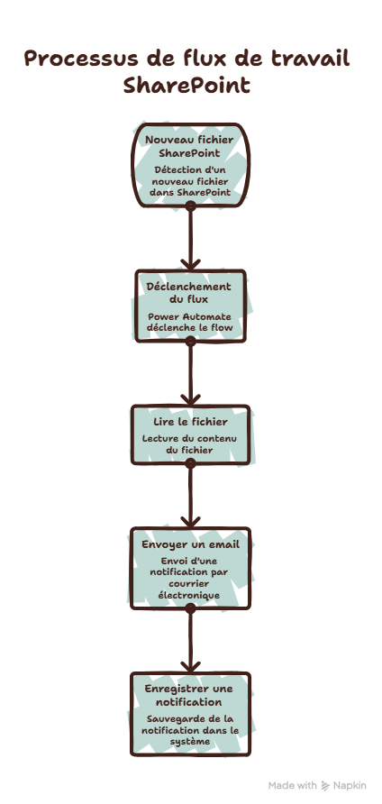
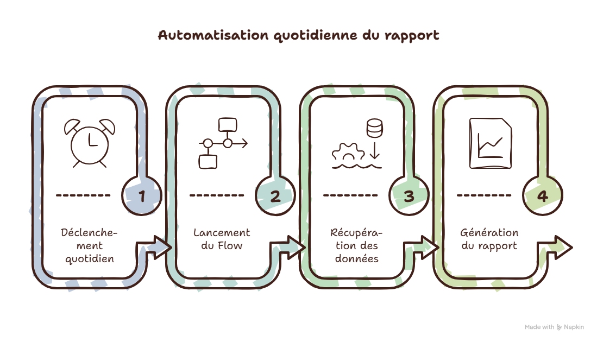
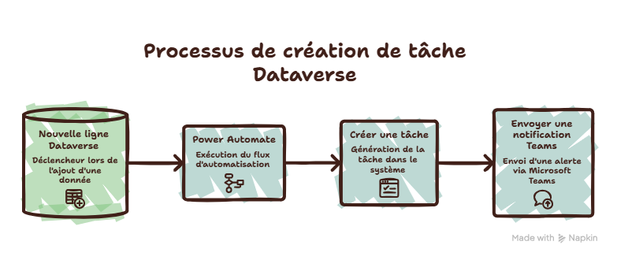
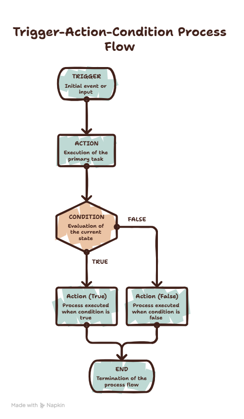

# ⚡ Power Automate — Résumé PL-900

## 1. Qu'est-ce que Power Automate ?

**Power Automate** est le service de Microsoft Power Platform permettant **d'automatiser des processus et des tâches** entre différentes applications et services.

L'idée fondamentale :

> **Un événement se produit → un flux démarre → des actions sont exécutées.**

Exemple :



---

# 2. Les principaux types de flows

### 🔵 Automated Cloud Flow

Le flow démarre automatiquement lorsqu'un événement se produit.

Exemple :

```text
Nouvel email reçu
        ↓
Flow déclenché
        ↓
Enregistrer la pièce jointe dans SharePoint
```

**Mot-clé examen : événement / déclencheur automatique.**

---

### 🟢 Instant Cloud Flow

Le flow est déclenché **manuellement par un utilisateur**.

Exemple :

```text
Bouton Power Apps
        ↓
Power Automate
        ↓
Créer une demande d'approbation
```

Il peut également être déclenché depuis d'autres interfaces compatibles.

**Mot-clé : manuel.**

---

### 🟡 Scheduled Cloud Flow

Le flow s'exécute selon une **planification**.

Exemple :



Il utilise notamment le connecteur **Recurrence**.

**Mot-clé : horaire / périodique.**

---

### 🟠 Desktop Flow

Les **Desktop flows** permettent d'automatiser des tâches sur un ordinateur.

C'est le domaine de la **RPA — Robotic Process Automation**.

Exemple :

```text
Ouvrir une application legacy
        ↓
Lire des données
        ↓
Copier les données
        ↓
Remplir un formulaire
```

Utile lorsqu'une application ne possède pas d'API ou de connecteur adapté.

---

# 3. Trigger vs Action

C'est un point **très important**.

### Trigger

Le **trigger** démarre le flow.

Exemples :

* un nouvel email arrive ;
* un fichier est créé ;
* un élément SharePoint est modifié ;
* une date est atteinte ;
* un utilisateur appuie sur un bouton.

```text
TRIGGER
   ↓
Actions
```

### Action

Une **action** est une opération exécutée par le flow.

Exemples :

* envoyer un email ;
* créer un fichier ;
* ajouter une ligne ;
* appeler une API ;
* envoyer une notification.

```text
Trigger
   ↓
Action
   ↓
Action
   ↓
Action
```

---

# 4. Connecteurs

Les **connecteurs** permettent à Power Automate de communiquer avec différents services.

Exemples :

* Outlook
* SharePoint
* Teams
* OneDrive
* Excel
* SQL Server
* Dataverse
* Salesforce
* Azure

Exemple :

```text
SharePoint
    ↓
Power Automate
    ↓
Outlook
```

Power Automate orchestre les opérations entre les différents services.

---

# 5. Standard vs Premium

Les connecteurs peuvent être classés notamment en :

### Standard connectors

Disponibles avec certaines licences Power Platform / Microsoft 365.

Exemples courants :

* Outlook
* SharePoint
* OneDrive

### Premium connectors

Nécessitent généralement une licence appropriée.

Exemples :

* SQL Server
* Salesforce
* certains services Azure
* certaines API et intégrations d'entreprise

**À retenir pour l'examen :**

> Un connecteur premium peut avoir un impact sur les besoins de licence.

---

# 6. Conditions

Power Automate permet de créer de la logique conditionnelle.

Exemple :


On peut utiliser :

* `Condition`
* `Switch`
* expressions
* variables

---

# 7. Approvals

Power Automate peut gérer des **processus d'approbation**.

Exemple :


Les approbations sont un cas d'utilisation très classique de Power Automate.

---

# 8. Variables

Les flows peuvent utiliser des variables pour stocker temporairement des valeurs.

Exemples :

```text
String
Integer
Boolean
Array
Object
```

Exemple :

```text
Variable : total
Valeur   : 1500
```

Puis :

```text
SI total > 1000
    → Approval
SINON
    → Validation automatique
```

---

# 9. Expressions

Power Automate possède un langage d'expressions permettant de manipuler les données.

Exemples de besoins :

* concaténer du texte ;
* convertir une valeur ;
* comparer des données ;
* manipuler des dates ;
* récupérer une valeur dans une réponse.

On retrouve notamment des fonctions comme :

```text
concat()
if()
equals()
contains()
length()
```

Pour la **PL-900**, il faut surtout comprendre leur rôle plutôt que mémoriser toutes les fonctions.

---

# 10. Power Automate + Power Apps

Les deux services sont souvent utilisés ensemble.

```text
Power Apps
     ↓
Utilisateur
     ↓
Power Automate
     ↓
Dataverse / SharePoint / SQL
```

Exemple :

Une application Power Apps permet à un employé de demander un achat.

Power Automate :

1. récupère la demande ;
2. vérifie le montant ;
3. demande une approbation ;
4. enregistre le résultat ;
5. envoie une notification.

---

# 11. Power Automate + Dataverse

Power Automate peut lire et modifier les données stockées dans **Microsoft Dataverse**.

Exemple :



---

# 12. Gestion des erreurs

Un flow peut échouer.

Power Automate permet notamment de contrôler l'exécution des actions avec les paramètres de **Configure run after**.

Cela permet de déclencher une action :

* lorsque l'action précédente réussit ;
* lorsqu'elle échoue ;
* lorsqu'elle est ignorée ;
* lorsqu'elle expire.

Exemple :

```text
API Call
   ↓
   ├── Success → Continuer
   │
   └── Failure → Envoyer une alerte
```

---

# 13. Solutions

Les **Solutions** sont importantes dans un environnement professionnel.

Elles permettent de regrouper et transporter des composants Power Platform :

```text
Solution
├── Power Apps
├── Power Automate flows
├── Dataverse tables
├── Connecteurs
└── autres composants
```

Elles sont particulièrement utiles pour gérer le **ALM — Application Lifecycle Management**.

Exemple :

```text
Development
      ↓
Test
      ↓
Production
```

---

# 14. Data Loss Prevention — DLP

Les **DLP policies** permettent de contrôler comment les connecteurs peuvent être utilisés ensemble afin de protéger les données de l'entreprise.

Les connecteurs peuvent notamment être regroupés en catégories comme :

* Business
* Non-business
* Blocked

Exemple :

```text
Données entreprise
       ↓
SharePoint
       ↓
❌ Service non autorisé
```

L'objectif est d'empêcher qu'un utilisateur crée facilement un flux permettant d'exfiltrer des données sensibles vers un service non approuvé.

---

# 🧠 À retenir pour la PL-900

| Concept               | À retenir                             |
| --------------------- | ------------------------------------- |
| **Power Automate**    | Automatiser des processus             |
| **Trigger**           | Déclenche le flow                     |
| **Action**            | Opération exécutée par le flow        |
| **Automated flow**    | Déclenché par un événement            |
| **Instant flow**      | Déclenché manuellement                |
| **Scheduled flow**    | Déclenché selon une planification     |
| **Desktop flow**      | RPA / automatisation du poste         |
| **Connector**         | Connexion à un service                |
| **Premium connector** | Peut nécessiter une licence premium   |
| **Condition**         | Logique `if/else`                     |
| **Approval**          | Processus de validation               |
| **Variable**          | Stockage temporaire d'une valeur      |
| **Solution**          | Packaging + ALM                       |
| **DLP**               | Protection et gouvernance des données |

## 🎯 Le schéma à mémoriser



**Phrase à retenir pour l'examen :**

> **Power Automate = déclencher + automatiser + connecter + conditionner + orchestrer des processus.**
